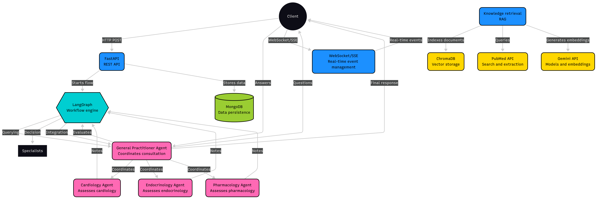
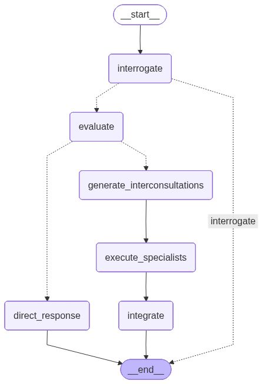

# Multi-Agent AI Medical Consultation System

An intelligent system that simulates the medical interconsultation process using multiple specialized AI agents, each with access to specialized knowledge bases via RAG, scientific literature search, and evidence-based reasoning.

## Overview

This system recreates the interaction between healthcare professionals using specialized AI agents, enabling more comprehensive medical care grounded in scientific evidence.

### Traditional Medical Workflow

1. **Initial Consultation**: A patient is seen by a general practitioner
2. **Evaluation**: The doctor analyzes whether they can resolve the case or need support
3. **Interconsultation**: If needed, generates interconsultation notes to specialists
4. **Specialized Response**: Each specialist analyzes and responds with their expertise
5. **Integration**: The general practitioner integrates the responses and generates a plan

### AI System Workflow



The system implements a sophisticated multi-agent workflow using LangGraph:

1. **Interrogation Phase**: GP gathers necessary patient information
2. **Evaluation**: Determines if direct response is possible or specialists are needed
3. **Parallel Specialist Execution**: Multiple specialists analyze the case simultaneously
4. **Integration**: GP synthesizes all responses into a comprehensive clinical record

#### LangGraph Architecture



**Node Structure**:
- `__start__` → Entry point
- `interrogate` → Patient information gathering
- `evaluate` → Case complexity assessment
- `direct_response` → Simple cases (GP answers directly)
- `generate_interconsultations` → Create specialist consultation notes
- `execute_specialists` → ⚡ **Parallel execution** of specialist agents
- `integrate` → Synthesize all specialist responses
- `__end__` → Workflow completion

**Edge Types**:
- Solid lines (→): Direct transitions
- Dotted lines (⋯→): Conditional transitions based on evaluation

## Main Features

### 🤖 Multi-Agent System with LangGraph

- **General Practitioner Agent**: Intelligent router that evaluates consultations and coordinates specialists
- **Specialist Agents**: Each with deep knowledge in their area
- **Parallel Execution**: Multiple simultaneous interconsultations
- **Dynamic Flow**: Cycle management to request additional information

### 📚 RAG (Retrieval Augmented Generation)

- Specialized knowledge base per medical area
- Semantic search in clinical documents
- Embeddings with Google Gemini
- Vector store with ChromaDB

### 🔬 Scientific Literature Integration

- PubMed/NCBI search
- Access to clinical practice guidelines
- Evidence-based responses

### 📋 Medical Notes System

- **Interconsultation Note**: Context, specific question, and expectations
- **Counter-referral Note**: Evaluation, reasoning, and evidence-based response
- **Clinical Record**: Structured format with all interactions

### 🏗️ Extensible Architecture

- Easy addition of new specialists
- File-based configuration
- Plugin system for specific tools

## Technical Architecture

### Technology Stack

```
Backend
├── FastAPI              # Asynchronous web framework
├── LangGraph            # Agent orchestration
├── Google Gemini        # LLM (2.5 Pro/Flash)
├── LangChain            # RAG and agent components
├── ChromaDB             # Vector store
├── MongoDB              # Data persistence
└── NCBI E-utilities     # PubMed API
```

### System Components

#### 1. API Layer (FastAPI)

```python
POST   /api/v1/consultation                    # Start medical consultation
POST   /api/v1/consultation/{id}/respond       # Add additional information
GET    /api/v1/consultation/{id}               # Get complete record
GET    /api/v1/consultation/{id}/status        # Flow status
WS     /api/v1/consultation/{id}/stream        # WebSocket for streaming
```

#### 2. Agent Layer (LangGraph)

```
Graph State:
├── original_consultation       # User's question
├── patient_context            # Case information
├── general_evaluation         # General practitioner's analysis
├── interconsultations[]       # List of generated interconsultations
├── counter_referrals[]        # Specialist responses
├── pending_questions[]        # Required additional info
└── final_response             # Final integration

Nodes:
├── evaluate_initial_consultation    # Evaluates if it can answer or interconsult
├── generate_interconsultations      # Creates interconsultation notes
├── execute_specialists              # Executes agents in parallel
├── verify_questions                 # Checks if there's pending info
├── integrate_responses              # Generates final record
└── request_information              # Waits for user input
```

#### 3. RAG System

```
Document Pipeline:
1. Document indexing by specialty
2. Semantic chunking
3. Embedding generation (Gemini Embeddings)
4. Storage in ChromaDB
5. Hybrid semantic search (vector + keyword)
```

#### 4. Database Schema (MongoDB)

```javascript
// Medical consultation
{
  _id: ObjectId,
  user_id: String,
  original_consultation: String,
  patient_context: Object,
  estado: "evaluating" | "interconsulting" | "waiting_info" | "completed",
  timestamp: DateTime,

  // Workflow
  general_evaluation: {
    can_answer_directly: Boolean,
    required_specialists: [String],
    reasoning: String
  },

  // Interconsultations
  interconsultations: [{
    specialty: String,
    specific_question: String,
    relevant_context: Object,
    timestamp: DateTime
  }],

  // Counter-referrals
  counter_referrals: [{
    specialty: String,
    evaluation: String,
    evidence_used: [String],
    response: String,
    requires_additional_info: Boolean,
    questions: [String],
    timestamp: DateTime
  }],

  // Final record
  clinical_record: {
    general_summary: String,
    complete_notes: String,
    final_response: String,
    timestamp: DateTime
  }
}
```

## Project Structure

```
clinical-crew/
├── app/
│   ├── __init__.py
│   ├── main.py                          # FastAPI application
│   │
│   ├── api/                             # Endpoints
│   │   ├── __init__.py
│   │   ├── v1/
│   │   │   ├── __init__.py
│   │   │   ├── consultations.py        # Consultation endpoints
│   │   │   └── websockets.py           # WebSocket handlers
│   │   └── dependencies.py             # Shared dependencies
│   │
│   ├── agents/                          # LangGraph agent system
│   │   ├── __init__.py
│   │   ├── graph.py                    # Main graph definition
│   │   ├── general_practitioner.py     # Coordinator agent
│   │   ├── specialists/
│   │   │   ├── __init__.py
│   │   │   ├── base.py                 # Base class for specialists
│   │   │   ├── cardiology.py
│   │   │   ├── endocrinology.py
│   │   │   └── pharmacology.py
│   │   └── prompts/                    # Prompt templates
│   │       ├── general_practitioner.py
│   │       └── specialists.py
│   │
│   ├── models/                          # Data models
│   │   ├── __init__.py
│   │   ├── consultation.py             # Pydantic models
│   │   ├── notes.py                    # Medical note models
│   │   └── database.py                 # MongoDB models (Beanie)
│   │
│   ├── rag/                             # RAG system
│   │   ├── __init__.py
│   │   ├── vector_store.py             # ChromaDB wrapper
│   │   ├── embeddings.py               # Gemini embeddings
│   │   ├── document_indexer.py         # Document indexing
│   │   └── retriever.py                # Semantic search
│   │
│   ├── services/                        # External services
│   │   ├── __init__.py
│   │   ├── gemini_client.py            # Google Gemini client
│   │   ├── pubmed_client.py            # PubMed client
│   │   └── notes_service.py            # Medical note generation
│   │
│   └── config/                          # Configuration
│       ├── __init__.py
│       ├── settings.py                 # Pydantic Settings
│       └── specialists.yaml            # Specialist configuration
│
├── data/                                # Data and documents
│   ├── knowledge_base/                 # Knowledge base
│   │   ├── cardiology/
│   │   ├── endocrinology/
│   │   └── pharmacology/
│   └── vectorstore/                    # ChromaDB storage
│
├── tests/                               # Tests
│   ├── __init__.py
│   ├── test_agents/
│   ├── test_api/
│   └── test_rag/
│
├── docs/                                # Additional documentation
│   ├── api_examples.md
│   ├── adding_specialists.md
│   └── medical_notes_format.md
│
├── .env.example                         # Example environment variables
├── .gitignore
├── docker-compose.yml                   # Docker services
├── Dockerfile                           # App container
├── requirements.txt                     # Python dependencies
├── pyproject.toml                       # Project configuration
└── README.md
```

## Installation and Setup

### Prerequisites

- Python 3.11+ (recommended 3.13)
- Docker (MongoDB runs automatically, you don't need Docker Compose if you already have MongoDB running)
- Google Gemini API Key
- NCBI account (for PubMed API - optional)

### Option 1: Quick Start (Recommended)

The `quickstart.sh` script automatically configures the entire environment:

```bash
# Give execution permissions and run
chmod +x quickstart.sh
./quickstart.sh
```

This script:

- ✅ Verifies Python 3.11+
- ✅ Creates virtual environment
- ✅ Installs all dependencies
- ✅ Copies `.env.example` to `.env`
- ✅ Starts MongoDB with Docker
- ✅ Creates necessary directories

**Important:** After running the script, edit `.env` and add your `GEMINI_API_KEY` and `PUBMED_EMAIL`.

### Option 2: Manual Installation

#### Step 1: Clone the Repository

```bash
git clone https://github.com/AI-Ethics-Community/clinical-crew.git
cd clinical-crew
```

#### Step 2: Configure Environment Variables

```bash
cp .env.example .env
```

Edit `.env` with your credentials (minimum required):

```bash
# REQUIRED: Google Gemini API Key
GEMINI_API_KEY=your_api_key_here

# REQUIRED: Email for PubMed API
PUBMED_EMAIL=dc.lerma@ugto.mx

# Optional: NCBI API Key for higher rate limits
PUBMED_API_KEY=your_ncbi_api_key

# The rest of the values have adequate defaults
```

#### Step 3: Install Dependencies

```bash
# Create virtual environment
python3 -m venv venv
source venv/bin/activate  # On Windows: venv\Scripts\activate

# Install dependencies
pip install -r requirements.txt
```

**Note:** If you have dependency conflicts, the `requirements.txt` file is already configured with compatible versions.

#### Step 4: Start MongoDB

```bash
# If you have Docker installed
docker run -d -p 27017:27017 --name hacknation_mongodb mongo:7.0

# Or if you already have MongoDB installed locally, just make sure it's running
```

#### Step 5: Run the Application

```bash
# Development with auto-reload
python3 -m app.main

# Or using uvicorn directly
uvicorn app.main:app --reload --host 0.0.0.0 --port 8000

# Production
uvicorn app.main:app --host 0.0.0.0 --port 8000 --workers 4
```

### Verify Installation

The API will be available at: `http://localhost:8000`

```bash
# Verify health check
curl http://localhost:8000/health

# Access interactive documentation
open http://localhost:8000/docs  # or visit in your browser
```

### Knowledge Base Index (Optional)

If you want to use the RAG system with custom documents:

```bash
# Index all documents
python -m app.rag.document_indexer --all

# Index specific specialty
python -m app.rag.document_indexer --specialty cardiology
```

**Note:** The system works without indexed documents, using only LLM knowledge and PubMed.

Interactive documentation: `http://localhost:8000/docs`

## API Usage

### Example 1: Simple Consultation

```bash
curl -X POST "http://localhost:8000/api/v1/consultation" \
  -H "Content-Type: application/json" \
  -d '{
    "consultation": "45-year-old male patient with decompensated type 2 diabetes. Can I start sertraline for depression?",
    "context": {
      "age": 45,
      "sex": "male",
      "diagnoses": ["Type 2 Diabetes Mellitus", "Depression"],
      "current_medications": ["Metformin 850mg every 12h", "Glibenclamide 5mg every 24h"],
      "allergies": []
    }
  }'
```

Response:

```json
{
  "consultation_id": "507f1f77bcf86cd799439011",
  "status": "processing",
  "message": "Consultation received. The general practitioner is evaluating the case."
}
```

### Example 2: Get Complete Record

```bash
curl -X GET "http://localhost:8000/api/v1/consultation/507f1f77bcf86cd799439011"
```

Response (when complete):

```json
{
  "consultation_id": "507f1f77bcf86cd799439011",
  "status": "completed",
  "clinical_record": {
    "initial_note": {
      "type": "General Practitioner Evaluation",
      "timestamp": "2025-11-08T10:30:00Z",
      "content": "Patient with decompensated type 2 diabetes requiring antidepressant initiation. I require interconsultation with Endocrinology for glycemic control optimization and Pharmacology to evaluate drug interactions.",
      "decision": "interconsult",
      "requested_specialists": ["Endocrinology", "Pharmacology"]
    },

    "interconsultations": [
      {
        "specialty": "Endocrinology",
        "timestamp": "2025-11-08T10:30:05Z",
        "note": "Reason for interconsultation: Glycemic control optimization in patient starting antidepressant.\n\nBackground: Decompensated type 2 diabetes.\n\nCurrent medication: Metformin 850mg every 12h, Glibenclamide 5mg every 24h.\n\nSpecific question: Does the regimen need adjustment before starting SSRI?"
      },
      {
        "specialty": "Pharmacology",
        "timestamp": "2025-11-08T10:30:05Z",
        "note": "Reason for interconsultation: Pharmacological safety evaluation.\n\nProposed medication: Sertraline.\n\nCurrent medication: Metformin 850mg every 12h, Glibenclamide 5mg every 24h.\n\nSpecific question: Are there significant interactions? Does it require dose adjustment?"
      }
    ],

    "counter_referrals": [
      {
        "specialty": "Endocrinology",
        "timestamp": "2025-11-08T10:31:20Z",
        "evaluation": "Review of antidiabetic regimen in patient starting SSRI.",
        "evidence": [
          "ADA Standards of Medical Care in Diabetes 2024",
          "PMID: 34561234 - SSRI effects on glycemic control"
        ],
        "response": "RECOMMENDATIONS:\n\n1. Current regimen (Metformin + Glibenclamide) is adequate to start SSRI.\n\n2. CAUTION: SSRIs can affect glycemic control:\n   - Sertraline may cause hyperglycemia in initial phase\n   - Subsequently may improve glycemia (dual effect)\n\n3. RECOMMENDED MONITORING:\n   - Capillary glucose 3 times daily for 2 weeks\n   - Follow-up HbA1c in 3 months\n   - Adjust hypoglycemic agents according to evolution\n\n4. Does not require preventive modification of antidiabetic regimen.\n\nREFERENCES: ADA 2024 Guidelines, Diabetes Care 2023;46(Suppl.1)."
      },
      {
        "specialty": "Pharmacology",
        "timestamp": "2025-11-08T10:31:45Z",
        "evaluation": "Analysis of Sertraline drug interactions with antidiabetic regimen.",
        "evidence": [
          "Micromedex Drug Interactions Database",
          "PMID: 28765432 - Sertraline safety in diabetes",
          "FDA Prescribing Information - Sertraline"
        ],
        "response": "INTERACTION ANALYSIS:\n\n1. SERTRALINE + METFORMIN:\n   - No significant interaction\n   - Safe to combine\n\n2. SERTRALINE + GLIBENCLAMIDE:\n   - MODERATE SEVERITY interaction\n   - Mechanism: Both metabolized by CYP2C9\n   - Risk: Possible increased glibenclamide concentration → higher hypoglycemia risk\n\n3. RECOMMENDATIONS:\n   a) INITIAL DOSE: Sertraline 25-50mg/day\n   b) TITRATION: Gradual increase according to response\n   c) MONITORING: Watch for hypoglycemia symptoms\n   d) EDUCATION: Hypoglycemia warning signs\n   e) Consider switching to Metformin + DPP4i if frequent hypoglycemia\n\n4. CONTRAINDICATIONS: None absolute.\n\nCONCLUSION: CAN BE STARTED with mentioned precautions.\n\nREFERENCES: Micromedex 2025, Drug Interact Facts 2025."
      }
    ],

    "final_response": {
      "timestamp": "2025-11-08T10:32:00Z",
      "content": "INTERCONSULTATION INTEGRATION\n\n45-year-old male patient with T2DM + Depression.\n\nCONSULTATION: Can Sertraline be started?\n\nRESPONSE: YES, CAN BE STARTED WITH PRECAUTIONS.\n\nRATIONALE:\n\n1. ENDOCRINE SAFETY (Endocrinology):\n   - Current antidiabetic regimen is adequate\n   - Does not require preventive adjustment\n   - Close glycemic monitoring recommended\n\n2. PHARMACOLOGICAL SAFETY (Pharmacology):\n   - Sertraline-Glibenclamide interaction: MODERATE\n   - Main risk: Hypoglycemia\n   - Management: Low initial dose, gradual titration, monitoring\n\nRECOMMENDED THERAPEUTIC PLAN:\n\n1. START: Sertraline 25-50mg in the morning\n2. TITRATE: Increase by 25-50mg every 2 weeks according to response (max 200mg)\n3. MONITORING:\n   - Capillary glucose 3 times/day x 2 weeks\n   - Weekly appointments first 2 weeks\n   - Evaluate antidepressant response in 4-6 weeks\n4. EDUCATION:\n   - Signs of hypoglycemia\n   - Continue antidiabetic medications\n   - Keep glucose log\n\nREFERRAL CRITERIA:\n- Frequent hypoglycemia → reevaluate antidiabetic regimen\n- No response to Sertraline in 8 weeks → Psychiatry\n\nLEVEL OF EVIDENCE: High (ADA 2024 Guidelines, Micromedex, systematic reviews).\n\nFOLLOW-UP: 1 week."
    }
  }
}
```

### Example 3: Add Additional Information

If a specialist requires more data:

```bash
curl -X POST "http://localhost:8000/api/v1/consultation/507f1f77bcf86cd799439011/respond" \
  -H "Content-Type: application/json" \
  -d '{
    "additional_information": {
      "creatinine": "1.2 mg/dL",
      "hba1c": "8.5%",
      "blood_pressure": "140/90 mmHg"
    }
  }'
```

## Medical Notes Format

### Interconsultation Note

Standard structure that the general practitioner sends to the specialist:

```
INTERCONSULTATION NOTE TO [SPECIALTY]

REASON FOR INTERCONSULTATION:
[Specific reason for consultation]

RELEVANT BACKGROUND:
[Pertinent case information]

CLINICAL CONTEXT:
[Current patient situation]

SPECIFIC QUESTION:
[What the specialist is expected to answer]

RELEVANT INFORMATION:
[Clinical data, labs, medications, etc.]

EXPECTATION:
[What type of guidance is being sought]
```

### Counter-referral Note

Specialist response structure:

```
COUNTER-REFERRAL NOTE - [SPECIALTY]

EVALUATION:
[Case analysis from specialized perspective]

EVIDENCE REVIEW:
[Sources consulted: guidelines, articles, knowledge bases]

References used:
- [Guideline/Article 1]
- [PMID: xxxxx]
- [Database consulted]

CLINICAL REASONING:
[Thought process and applied criteria]

RESPONSE TO THE QUESTION:
[Clear and specific evidence-based response]

RECOMMENDATIONS:
1. [Recommendation 1]
2. [Recommendation 2]
...

LEVEL OF EVIDENCE:
[Quality of evidence used]

ADDITIONAL INFORMATION REQUIRED (if applicable):
- [Data 1 needed]
- [Data 2 needed]
```

## Agent Architecture

### General Practitioner Agent

**Responsibilities:**

- Receive and analyze initial consultation
- Evaluate case complexity
- Decide if it can respond directly or needs to interconsult
- Select appropriate specialists
- Generate contextualized interconsultation notes
- Integrate counter-referrals
- Generate final record

**Tools:**

- General medical knowledge (RAG)
- Clinical reasoning capability
- Medical note generation

**LLM Model:** Gemini 2.5 Pro

### Specialist Agents

Each specialist has the same base structure but with specific configuration:

**Responsibilities:**

- Receive interconsultation note
- Analyze question and context
- Search for evidence in their knowledge base (RAG)
- Consult scientific literature (PubMed) if necessary
- Reason based on guidelines and evidence
- Generate structured counter-referral
- Request additional information if insufficient

**Tools:**

- Specialized RAG (documents from their area)
- PubMed search
- Specific diagnostic criteria
- Clinical practice guidelines

**LLM Model:** Gemini 2.5 Flash (faster for parallel specialists)

### Initial Specialists

1. **Cardiology**

   - Cardiovascular diseases
   - Diagnostic criteria
   - ACC/AHA Guidelines

2. **Endocrinology**

   - Diabetes, thyroid, hormonal disorders
   - ADA, Endocrine Society Guidelines

3. **Pharmacology**
   - Drug interactions
   - Doses, contraindications
   - Databases: Micromedex, FDA

## Adding New Specialists

The system is designed for easy extensibility:

### Step 1: Add Configuration

Edit `app/config/specialists.yaml`:

```yaml
specialists:
  neurology:
    name: "Neurology"
    description: "Specialist in nervous system diseases"
    model: "gemini-2.5-flash-latest"
    rag_collection: "neurology_kb"
    tools:
      - pubmed_search
      - diagnostic_criteria
    custom_prompt: |
      You are an expert neurologist specialized in...
      Your approach should be based on...
```

### Step 2: Add Knowledge Base

```bash
# Place documents in:
data/knowledge_base/neurology/
  ├── stroke_guideline.pdf
  ├── epilepsy_criteria.pdf
  └── ...

# Index
python -m app.rag.document_indexer --specialty neurology
```

### Step 3: (Optional) Create Specialized Class

If it requires specific logic, create `app/agents/specialists/neurology.py`:

```python
from app.agents.specialists.base import SpecialistBase

class NeurologySpecialist(SpecialistBase):
    def __init__(self):
        super().__init__(specialty="neurology")

    def additional_tools(self):
        # Neurology-specific tools
        return [self.nihss_scale, self.epilepsy_criteria]
```

The system will automatically detect and use the new specialist.

## Main Technologies and Dependencies

```python
# LLM and Agents
langchain>=0.3.0
langgraph>=0.3.0
google-generativeai>=0.8.0

# Web Framework
fastapi>=0.115.0
uvicorn[standard]>=0.30.0
websockets>=13.0

# Database
motor>=3.6.0          # MongoDB async driver
beanie>=1.26.0        # MongoDB ODM

# RAG
chromadb>=0.5.0
sentence-transformers>=3.0.0

# External APIs
biopython>=1.84       # PubMed/Entrez
httpx>=0.27.0

# Utilities
pydantic>=2.9.0
pydantic-settings>=2.5.0
python-dotenv>=1.0.0
pyyaml>=6.0
```

## Complete Environment Variables

```bash
# =============================================================================
# GOOGLE GEMINI CONFIGURATION
# =============================================================================
GEMINI_API_KEY=your_api_key_here
GEMINI_PRO_MODEL=gemini-2.5-pro-latest
GEMINI_FLASH_MODEL=gemini-2.5-flash-latest
GEMINI_TEMPERATURE=0.1              # Low temperature for medical consistency
GEMINI_MAX_OUTPUT_TOKENS=8192

# =============================================================================
# DATABASE CONFIGURATION (MongoDB)
# =============================================================================
MONGODB_URL=mongodb://localhost:27017
MONGODB_DB_NAME=hacknation_medical
MONGODB_MAX_CONNECTIONS=10
MONGODB_MIN_CONNECTIONS=1

# =============================================================================
# VECTOR STORE (ChromaDB)
# =============================================================================
CHROMA_PERSIST_DIRECTORY=./data/vectorstore
CHROMA_COLLECTION_PREFIX=medical_kb

# =============================================================================
# PUBMED/NCBI CONFIGURATION
# =============================================================================
PUBMED_EMAIL=dc.lerma@ugto.mx
PUBMED_API_KEY=your_ncbi_api_key_optional
PUBMED_MAX_RESULTS=10
PUBMED_TOOL_NAME=ClinicalCrew

# =============================================================================
# API CONFIGURATION
# =============================================================================
API_V1_PREFIX=/api/v1
API_TITLE=Clinical Crew
API_VERSION=1.0.0
DEBUG=true
CORS_ORIGINS=http://localhost:3000,http://localhost:3001

# =============================================================================
# AGENT CONFIGURATION
# =============================================================================
MAX_INTERCONSULTAS_PARALELAS=5
TIMEOUT_ESPECIALISTA_SEGUNDOS=120
ENABLE_STREAMING=true

# =============================================================================
# LOGGING
# =============================================================================
LOG_LEVEL=INFO
LOG_FORMAT=json
```

## Roadmap

### Phase 1: MVP (Current)

- [x] Architecture design
- [ ] Basic agent implementation
- [ ] Functional RAG system
- [ ] Complete REST API
- [ ] 3 initial specialists

### Phase 2: Improvements

- [ ] More specialists (10+)
- [ ] Intelligent cache system
- [ ] Metrics and observability
- [ ] Complete automated tests
- [ ] CI/CD pipeline

### Phase 3: Production

- [ ] Authentication and authorization
- [ ] Rate limiting
- [ ] Multitenancy
- [ ] Backup and recovery
- [ ] HIPAA/GDPR compliance

### Phase 4: Advanced Features

- [ ] FHIR integration
- [ ] Medical image analysis
- [ ] Treatment plan generation
- [ ] Clinical alert system
- [ ] Analytics dashboard

## Important Considerations

### Limitations and Disclaimers

1. **Not a medical device**: This system is a clinical decision support tool, NOT a substitute for professional medical judgment.

2. **Validation required**: All recommendations must be validated by a healthcare professional before being applied clinically.

3. **Current evidence**: The system is based on evidence available up to the date of its knowledge base update.

4. **Limited context**: The system only knows the information provided to it. Missing information can affect recommendations.

### Security and Privacy

1. **Sensitive data**: Never include patient identifiable information (PHI) in development environments.

2. **Encryption**: In production, all data must be encrypted in transit and at rest.

3. **Audit**: All consultations and responses must be auditable.

4. **Compliance**: Ensure compliance with local regulations (HIPAA in USA, GDPR in Europe, etc.).

## Troubleshooting

### Error: "ModuleNotFoundError" on startup

If you see module not found errors, verify that:

1. The virtual environment is activated: `source venv/bin/activate`
2. Dependencies are installed: `pip install -r requirements.txt`

### Error: "Cannot connect to MongoDB"

```bash
# Verify MongoDB is running
docker ps | grep mongo

# If not running, start it
docker run -d -p 27017:27017 --name hacknation_mongodb mongo:7.0
```

### Error: "ValidationError for Settings"

Make sure the `.env` file has the required variables:

- `GEMINI_API_KEY`
- `PUBMED_EMAIL`

### Error: "Specialty not found in config"

Specialty names must be in English:

- `cardiology` ✅ (not `cardiologia` ❌)
- `endocrinology` ✅ (not `endocrinologia` ❌)
- `pharmacology` ✅ (not `farmacologia` ❌)

### Server starts but fails immediately

Check complete logs:

```bash
python3 -m app.main 2>&1 | tee app.log
```

Common problems:

- Port 8000 already in use: change to another port with `--port 8001`
- MongoDB not available: verify connection
- Invalid Gemini API key: verify your `.env`

### Dependency conflicts with pip

The `requirements.txt` already has specific versions that are compatible. If you have problems:

```bash
# Remove virtual environment and create it again
rm -rf venv
python3 -m venv venv
source venv/bin/activate
pip install --upgrade pip
pip install -r requirements.txt
```

### For more help

- Review documentation in [docs/](docs/)
- Check [CLAUDE.md](CLAUDE.md) for architecture details
- Open an issue on GitHub with complete logs

## Support and Contribution

### Report Issues

GitHub Issues: [https://github.com/AI-Ethics-Community/clinical-crew/issues](https://github.com/AI-Ethics-Community/clinical-crew/issues)

### Contribute

See [CONTRIBUTING.md](CONTRIBUTING.md) for contribution guidelines.

### Contact

**Project Authors:**
- Diego Lerma - [dc.lerma@ugto.mx](mailto:dc.lerma@ugto.mx)
- Karla Doctor - [ka.doctormauricio@gmail.com](mailto:ka.doctormauricio@gmail.com)

**Documentation:** [docs/](docs/)

## License

[MIT License](LICENSE)

## Acknowledgments

**Clinical Crew** was developed by:
- **Diego Lerma** - Lead Developer
- **Karla Doctor** - Co-Developer

This project is part of the AI Ethics Community initiative.

### Technologies Used

- Google Gemini
- LangChain and LangGraph
- FastAPI
- MongoDB
- ChromaDB

---

**Version:** 1.0.0
**Last updated:** 2025-11-09
**Authors:** Diego Lerma, Karla Doctor
**Organization:** AI Ethics Community
